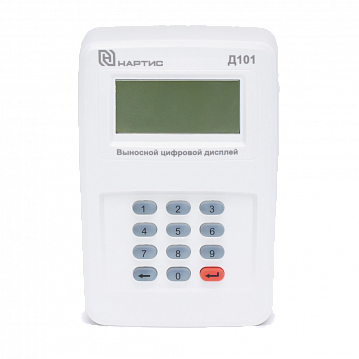
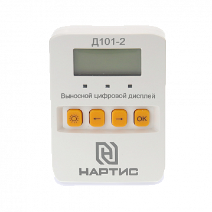

[СПОДЭС/DLMS/COSEM](https://github.com/latonita/esphome-dlms-cosem) •
[МЭК-61107/IEC-61107](https://github.com/latonita/esphome-iec61107-meter) •
[Энергомера МЭК/IEC](https://github.com/latonita/esphome-energomera-iec) •
[Энергомера CE](https://github.com/latonita/esphome-energomera-ce) •
[СПб ЗИП ЦЭ2727А](https://github.com/latonita/esphome-ce2727a-meter) •
[Ленэлектро ЛЕ-2](https://github.com/latonita/esphome-le2-meter) •
[Пульсар-М](https://github.com/latonita/esphome-pulsar-m) •
[Энергомера BLE](https://github.com/latonita/esphome-energomera-ble) •
[Нартис RF433](https://github.com/latonita/esphome-nartis-rf-meter) •
[Нартис RF433-2](https://github.com/latonita/esphome-nartis-rf-2-meter) •
[Нартис UART RF433-2](https://github.com/latonita/esphome-uart-nartis-rf) •
[Nordic UART (BLE NUS)](https://github.com/latonita/esphome-nordic-uart-ble) •

# esphome-nartis-wmbus

 

Компонет для подключение ESPHome к счётчикам электроэнергии (ПУ) Нартис И100, И300, И500 по радиоканалу RF 433 МГц. 

Необходим ESP32 + радиомодуль CMT2300A.

### 1. ПУ, работающие с дисплеем Д101 и/или коммуникационным модулем RF433 (до 2024)
В данных ПУ Нартис использует протокол, похожий на WMbus. Возможно, они построены на китайской платформе Kaifa. 

Используйте компонент [Нартис RF433](https://github.com/latonita/esphome-nartis-rf-meter).

### 2. ПУ, работающие с дисплеем Д101-2 и/или коммуникационным модулем RF433-2 (с 2024)
В данных ПУ частотная сетка и транспортный протокол отличается. Дисплей использует быстрый протокол DL/T, а USB модуль - СПОДЭС.

#### 2.1 DL/T 645
Счетчики Нартис И100/И300/И500 2024+ г.в., вероятно, построены на китайской платформе **Wasion**. Выносной дисплей работает с протоколом из Поднебесной - **DL/T 645-1997**. 
Протокол работает быстро и надежно: два запроса и большинство параметров загружены.

Используйте компонент: [Нартис RF433-2](https://github.com/latonita/esphome-nartis-rf-2-meter)

#### 2.2 СПОДЭС
Также используется стандартный протокол СПОДЭС/DLMS/COSEM. Работает медленнее и дольше, но даёт доступ ко всем параметрам по их OBIS кодам.

Используйте компонент: [Нартис UART RF433-2](https://github.com/latonita/esphome-uart-nartis-rf) в связке с [СПОДЭС/DLMS/COSEM](https://github.com/latonita/esphome-dlms-cosem).

